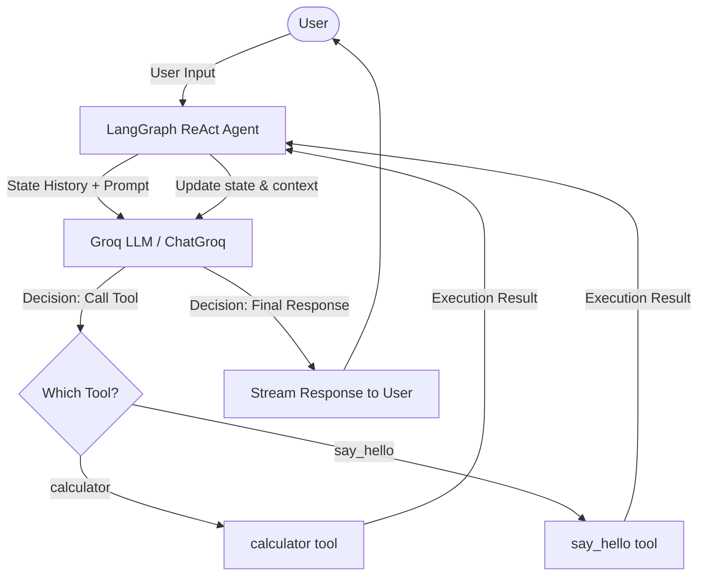

# LangGraph ReAct Chatbot with Groq

A lightweight, real-time streaming chatbot application built using Python, LangGraph, and ChatGroq. The agent utilizes the **ReAct (Reasoning and Acting)** framework to dynamically decide between responding directly or executing specific tools to answer user queries.


---

## 🏗️ Architecture

The system utilizes an agentic design where a central Language Model (LLM) acts as the "brain," and LangGraph manages the state machine and agent runtime.



### Key Components

1. **State Management (`langgraph`)**:
   - Manages the conversation state and handles the agent loop, automatically routing tool inputs and outputs.
2. **Language Model (`langchain_groq`)**:
   - Uses `ChatGroq` powered by Groq's high-speed API to process user intentions and make decisions.
3. **Tools Schema**:
   - Custom functions decorated with `@tool` that are converted into JSON schemas and passed to the LLM to extend its capabilities.
4. **Execution Loop**:
   - Streams responses chunk-by-chunk to the terminal console to ensure a highly responsive user experience.

---

## 🔄 Workflow

When a query is entered by the user, the following steps are performed:

1. **Input Collection**: The user submits input in the interactive CLI loop.
2. **Reasoning Phase**: The agent passes the conversation history and the new message to the Groq model.
3. **Decision Making**:
   - **Scenario A (Direct Response)**: If the LLM determines that no external tool is required, it directly formulates a final message, which is streamed block-by-block to the console.
   - **Scenario B (Tool Execution)**: If the LLM determines a tool is needed (e.g., to perform math or greet a user by name), it returns a tool call request.
4. **Action (Acting)**: The LangGraph ReAct executor catches the tool request, runs the corresponding local function (`calculator` or `say_hello`), appends the tool's return value to the state, and passes the updated state back to the LLM.
5. **Final Output**: The LLM synthesizes the tool output into a natural response and streams it back to the user.

---

## 📂 Project Directory Structure

- [main.py](file:///d:/KLE_Gangavathi/KLE_Ganagavthi_GenAIGrok/main.py) - Contains the main entry point, tool definitions, agent initialization, and the interactive terminal CLI loop.
- [requirements.txt](file:///d:/KLE_Gangavathi/KLE_Ganagavthi_GenAIGrok/requirements.txt) - List of required Python packages.
- [.env](file:///d:/KLE_Gangavathi/KLE_Ganagavthi_GenAIGrok/.env) - Holds environment configurations (API keys and default model identifiers).

---

## 🛠️ Code Elements & Tools

The following symbols are defined in [main.py](file:///d:/KLE_Gangavathi/KLE_Ganagavthi_GenAIGrok/main.py):

* [calculator](file:///d:/KLE_Gangavathi/KLE_Ganagavthi_GenAIGrok/main.py#L16-L20) — A simple arithmetic tool to calculate the sum of two floats.
* [say_hello](file:///d:/KLE_Gangavathi/KLE_Ganagavthi_GenAIGrok/main.py#L23-L28) — A greeting utility tool for welcoming users.
* [main](file:///d:/KLE_Gangavathi/KLE_Ganagavthi_GenAIGrok/main.py#L30-L63) — Initializer function that loads environment configurations, creates the agent using `create_react_agent`, and runs the command-line interface conversation loop.

---

## 🚀 Startup & Installation Guide

Follow these steps to set up and run the application locally:

### 1. Prerequisites
- **Python**: Ensure Python 3.9+ is installed.
- **Groq API Key**: You need an active Groq API Key. Get one from the [Groq Console](https://console.groq.com/).

### 2. Configure Environment Variables
Create or modify the [.env](file:///d:/KLE_Gangavathi/KLE_Ganagavthi_GenAIGrok/.env) file in the root directory and define the following variables:

```env
GROQ_API_KEY=your_groq_api_key_here
GROQ_MODEL=qwen/qwen3.6-27b
```

### 3. Create a Virtual Environment (Recommended)
Open a terminal in the project directory and run:

```bash
# Create virtual environment
python -m venv .venv

# Activate virtual environment
# On Windows (PowerShell):
.venv\Scripts\Activate.ps1

# On Windows (cmd):
.venv\Scripts\activate.bat

# On Linux/macOS:
source .venv/bin/activate
```

### 4. Install Dependencies
Install the required packages using the [requirements.txt](file:///d:/KLE_Gangavathi/KLE_Ganagavthi_GenAIGrok/requirements.txt) file:

```bash
pip install -r requirements.txt
```

### 5. Run the Application
Execute the [main.py](file:///d:/KLE_Gangavathi/KLE_Ganagavthi_GenAIGrok/main.py) script:

```bash
python main.py
```

### 6. Interacting with the Chatbot
- Once started, you can type queries directly into the terminal prompt (`You: `).
- Try asking: `"What is 45.5 plus 54.5?"` to trigger the `calculator` tool.
- Try asking: `"Greet Alice"` or `"Say hello to Bob"` to trigger the `say_hello` tool.
- Type `quit` to exit the session.
