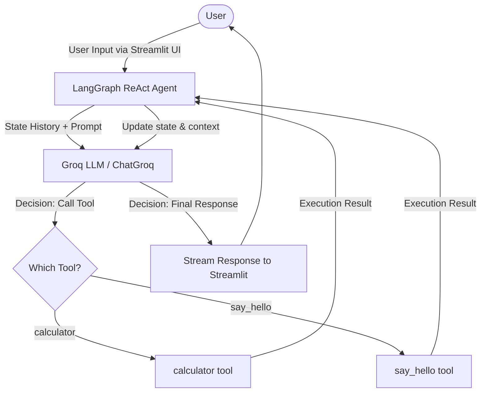

# LangGraph ReAct Chatbot with Groq & Streamlit

A modern, real-time streaming web chatbot application built using Python, [LangGraph](https://github.com/langchain-ai/langgraph), [ChatGroq](https://python.langchain.com/docs/integrations/chat/groq/), and [Streamlit](https://streamlit.io/). The agent utilizes the **ReAct (Reasoning and Acting)** framework to dynamically decide between responding directly or executing specific tools to answer user queries.

---

## 🏗️ Architecture

The system utilizes an agentic design where a central Language Model (LLM) acts as the "brain," and LangGraph manages the state machine and agent runtime. The user interface is driven by Streamlit to offer a sleek web experience.



### Key Components

1. **State Management (`langgraph`)**:
   - Manages the conversation state and handles the agent loop, automatically routing tool inputs and outputs.
2. **Language Model (`langchain_groq`)**:
   - Uses `ChatGroq` powered by Groq's high-speed API to process user intentions and make decisions.
3. **Tools Schema**:
   - Custom functions decorated with `@tool` that are converted into JSON schemas and passed to the LLM to extend its capabilities.
4. **Interactive Web Interface (`streamlit`)**:
   - Offers real-time streaming responses, detailed tool execution logs, and full control over settings via a custom dark-themed UI.

---

## ✨ Features

- **Sleek Custom Dark Theme**: Custom CSS featuring Zinc-950 and Indigo accents with premium typography (`Outfit` and `Inter` fonts).
- **Interactive Control Panel (Sidebar)**:
  - **LLM Model Selection**: Select between `qwen/qwen3.6-27b` (default fallback or set via `GROQ_MODEL` environment variable), `llama-3.3-70b-versatile`, `llama3-70b-8192`, and `mixtral-8x7b-32768`.
  - **System Mode Selector**: Switch between **Regular Mode** (polite, precise assistant) and **Fun/Witty Mode** (Grok-style rebellious, humorous, and cheeky persona).
  - **Temperature Adjustment**: Fine-tune model creativity.
  - **Editable System Instructions**: Tweak the core agent system instructions on the fly.
  - **Clear Chat History**: Instantly reset the current conversation state.
- **Detailed Tool Invocation Log**: Inspect tool call arguments and exact return outputs inside expandable Streamlit UI widgets in real-time.

---

## 🔄 Workflow

When a query is entered by the user in the chat interface:

1. **Input Collection**: The user submits input via the Streamlit chat input box.
2. **Reasoning Phase**: The agent passes the conversation history and the new message to the Groq model.
3. **Decision Making**:
   - **Scenario A (Direct Response)**: If the LLM determines that no external tool is required, it directly formulates a response, which is streamed block-by-block to the chat page.
   - **Scenario B (Tool Execution)**: If the LLM determines a tool is needed (e.g., to perform calculations or greet a user), it returns a tool call request.
4. **Action (Acting)**: The LangGraph ReAct executor runs the corresponding local function (`calculator` or `say_hello`), appends the tool's return value to the message state, and passes the updated history back to the LLM.
5. **Final Output**: The LLM synthesizes the tool output into a natural response and streams it back to the user.

---

## 📂 Project Directory Structure

- [main.py](file:///d:/KLE_Gangavathi/KLE_Ganagavthi_GenAIGrok/main.py) — Contains the Streamlit app configuration, tool definitions, agent initialization, custom dark-themed CSS, and the session-state message loop.
- [requirements.txt](file:///d:/KLE_Gangavathi/KLE_Ganagavthi_GenAIGrok/requirements.txt) — List of required Python packages.
- [.env](file:///d:/KLE_Gangavathi/KLE_Ganagavthi_GenAIGrok/.env) — Holds environment configurations (API keys and default model identifiers).
- [.env.example](file:///d:/KLE_Gangavathi/KLE_Ganagavthi_GenAIGrok/.env.example) — Template file showing structure for environment variables.

---

## 🛠️ Code Elements & Tools

The following symbols are defined in [main.py](file:///d:/KLE_Gangavathi/KLE_Ganagavthi_GenAIGrok/main.py):

* [calculator](file:///d:/KLE_Gangavathi/KLE_Ganagavthi_GenAIGrok/main.py#L17-L20) — A simple arithmetic tool to calculate the sum of two floats.
* [say_hello](file:///d:/KLE_Gangavathi/KLE_Ganagavthi_GenAIGrok/main.py#L22-L25) — A greeting utility tool for welcoming users.
* Custom theme styling rules start at [line 35](file:///d:/KLE_Gangavathi/KLE_Ganagavthi_GenAIGrok/main.py#L35).

---

## 🚀 Startup & Installation Guide

Follow these steps to set up and run the application locally:

### 1. Prerequisites
- **Python**: Ensure Python 3.9+ is installed.
- **Groq API Key**: You need an active Groq API Key. Get one from the [Groq Console](https://console.groq.com/).

### 2. Configure Environment Variables
Create a [.env](file:///d:/KLE_Gangavathi/KLE_Ganagavthi_GenAIGrok/.env) file in the root directory (using [.env.example](file:///d:/KLE_Gangavathi/KLE_Ganagavthi_GenAIGrok/.env.example) as reference) and define the following variables:

```env
GROQ_API_KEY=your_groq_api_key_here
GROQ_MODEL=qwen/qwen3.6-27b
```

### 3. Create a Virtual Environment (Recommended)
Open a terminal in the project directory and run:

```bash
# Create virtual environment
python -m venv .venv

# Activate virtual environment
# On Windows (PowerShell):
.venv\Scripts\Activate.ps1

# On Windows (cmd):
.venv\Scripts\activate.bat

# On Linux/macOS:
source .venv/bin/activate
```

### 4. Install Dependencies
Install the required packages using the [requirements.txt](file:///d:/KLE_Gangavathi/KLE_Ganagavthi_GenAIGrok/requirements.txt) file:

```bash
pip install -r requirements.txt
```

### 5. Run the Application
Execute the Streamlit server:

```bash
streamlit run main.py
```

### 6. Interacting with the Chatbot
- Once started, the application will launch in your default web browser (usually at `http://localhost:8501`).
- Type queries directly into the chat input box at the bottom of the page.
- Try asking: `"What is 45.5 plus 54.5?"` to trigger the `calculator` tool.
- Try asking: `"Greet Alice"` or `"Say hello to Bob"` to trigger the `say_hello` tool.
- Use the sidebar to toggle between **Regular** and **Fun/Witty** modes, change models, adjust system prompts, or clear history.

---

## 💻 Git Commands

Below are standard Git instructions for committing and pushing your changes:

```bash
# Check status of changed files
git status

# Add changes to stage
git add README.md

# Commit your changes
git commit -m "docs: update README to reflect Streamlit-based web chatbot implementation"

# Push to your repository
git push origin main
```
